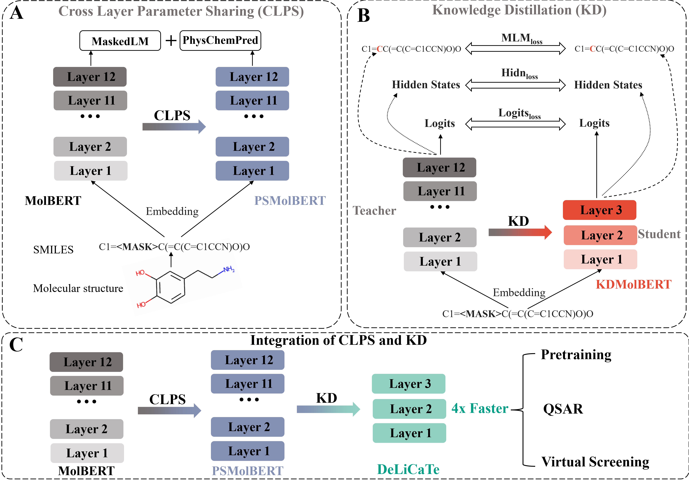

# DeLiCaTe

Implementation of the Paper "[Chemical transformer Compression for accelerating both training and inference of molecular modeling](https://arxiv.org/abs/2205.07582)" by Yi Yu and Karl Börjesson. We assumed that the **de**ep **li**ght **c**hemic**a**l **t**ransform**e**r (**DeLiCaTe**)  will accelerate both training and inference of chemical transformer for molecular modeling. 



## Installing
The compression methods in this package is based heavily on the MolBERT from BenevolentAI. The link of MolBERT is shown below:

https://github.com/BenevolentAI/MolBERT

### Prerequisites
```bash
python 3.7
numpy
MolBERT 
rdkit 2019.03.1.0
scikit-learn 0.21.3
pytorch-lightning 0.8.4
transformers 3.5.1
textbrewer 0.2.1
pytorch 1.7.0
```
### Install via Anaconda (recommended way)
```bash
git clone https://github.com/YiYuDL/DeLiCaTe.git
cd DeLiCaTe
conda create -y -q -n delicate -c rdkit rdkit=2019.03.1.0 python=3.7.3
conda activate delicate
pip install .
```
## Getting start
The compression methods here include cross-layer parameter sharing (CLPS), knowledge distillation (KD) and the integration of two mentioned methods. The obtained transformer models are PSMolBERT, KDMolBERT and DeLiCaTe, respectively. The model compression will be shown in turn. Then, the fine-tuning for QSAR and comparison of inference speed are shown. Finally, the inference speed among different transfomer models are compared.
### load pretrained model
The pretrained PSMolBERT (30-epoch) can be downloaded **[here](https://drive.google.com/file/d/1U_hpQNdKtY2GWSK7j0cOF5z0O9zadrwY/view?usp=sharing)** as well as [MolBERT](https://drive.google.com/file/d/12CqPBtf1DdB0JiJFjBmsijuvbYB8_O3O/view?usp=sharing) (100-epoch). Both of them are state_dict of models.
We expect to continue to release other pre-trained models when the paper is accepted.
### Cross-layer parameter sharing (CLPS)
You can use the guacamol dataset for CLPS pre-training as well as KD (links at the [bottom](https://github.com/BenevolentAI/MolBERT#data))
```shell script
python example/clps.py \
    --train_file data/guacamol_baselines/guacamol_v1_train.smiles \
    --valid_file data/guacamol_baselines/guacamol_v1_valid.smiles \
    --max_seq_length 128 \
    --batch_size 16 \
    --masked_lm 1 \
    --is_same_smiles 0 \
    --permute 1 \
    --max_epochs 30 \
    --val_check_interval 1 \
    --num_hidden_layers 12 
```
### Knowledge distillation (KD)
```shell script
python example/kd.py \
    --bert_config_file_T config_json/MolBert_config_T.json \
    --bert_config_file_S config_json/MolBert_config_L3.json \
    --T_start MolBERT \
    --tuned_checkpoint_T model/MolBERT_100.pkl \
    --train_file data/guacamol_baselines/guacamol_v1_train.smiles \
    --predict_file data/guacamol_baselines/guacamol_v1_valid.smiles \
    --num_train_epochs 13 \
    --output_dir /output_root_dir/KD \
    --temperature 8 \
    --matches L3_hidden_smmd L3_hidden_mse 
```
### Fine-tuning
We will take PSMolBERT as the example for fine-tuning.
```shell script
python example/run_finetuning.py \
    --pretrained_model_path model/PSMolBERT_30.pkl \
    --num_hidden_layers 12 \
    --freeze_level 0 \
    --model PSMolBERT \
    --learning_rate 3e-05 \
    --batch_size 16
``` 
### Inference speed comparison
As for PSMolBERT, KDMolBERT and DeLiCate, their inference speed could be compared with original MolBERT. Take DeLiCaTe for example:
```python
from inference_speed import speed_comparison
speed_comparison('DeLiCaTe')
```
