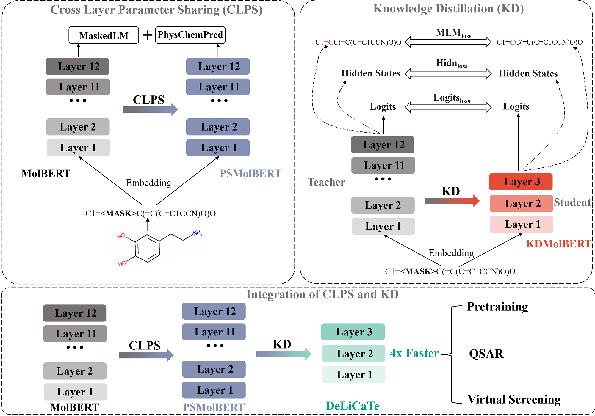

# DeLiCaTe

Implementation of the Paper "Chemical transformer Compression for accelerating both training and inference of molecular modeling" by Yi Yu and Karl Börjesson.



## Installing
The compression methods in this package is based heavily on the MolBERT from BenevolentAI. The link of MolBERT is shown below:

https://github.com/BenevolentAI/MolBERT

### Prerequisites
'''
python 3.7
numpy
rdkit 2019.03.1.0
scikit-learn 0.21.3
pytorch-lightning 0.8.4
transformers 3.5.1
pytorch 1.7.0
'''
### Install via Anaconda (recommended way)
```bash
git clone https://github.com/YiYuDL/DeLiCaTe.git
cd DeLiCaTe
conda create -y -q -n delicate -c rdkit rdkit=2019.03.1.0 python=3.7.3
conda activate delicate
pip install .
```
## Getting start
